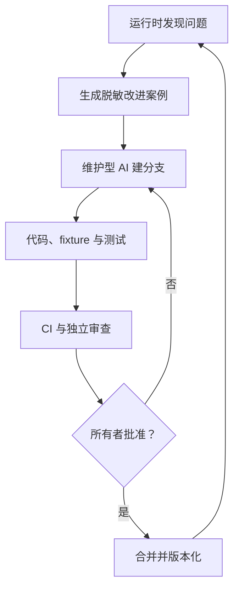

# AI 操作与持续改进边界

项目希望 AI 既能理解用户语言、操作购物工作流，又能在长期使用中帮助改进软件。两种职责必须隔离，否则网页提示注入、模型误判或一次异常就可能变成代码与权限变更。

## 1. 双通道架构

### 运行时 AI

运行时 AI 位于 MCP 宿主中，负责：

- 把自然语言需求整理为 `StartShoppingWorkflowInput`；
- 在信息不足时向用户追问预算、地区或硬性条件；
- 调用已注册的类型化 MCP 工具；
- 展示确定性报告，并在用户明确请求时调用可选解释器。

它不能：

- 写入或替换仓库代码；
- 修改评分公式、证据优先级或安全策略；
- 声称一个没有真实执行的工作流阶段已经完成；
- 扩大域名白名单、绕过访问限制、自动合并 PR 或发布版本。

### 维护型 AI

维护型 AI 在 GitHub/Codex 等开发环境中工作，负责：

- 读取规范设计、代码和脱敏复现案例；
- 在独立分支完成一个范围明确的改动；
- 补充固定 fixture、回归测试和用户可见影响说明；
- 运行 Ruff、Pyright、pytest、构建和隔离 wheel 验收；
- 创建 PR，等待 CI、审查与项目所有者确认。

维护型 AI 默认不读取用户的真实购物数据库、Cookie、密钥、地址或浏览器资料。运行时数据库也不得成为训练集或自动代码提示上下文。

## 2. 安全改进闭环

改进案例应只记录定位问题所需的最少信息：

| 字段 | 含义 |
|---|---|
| `software_version` | 出现问题的软件版本 |
| `stage` | 搜索、详情、规范化、评分、报告等阶段 |
| `stable_error_code` | 已脱敏的稳定错误码 |
| `sanitized_input` | 去除账号、地址、Cookie、密钥和可复用会话后的输入 |
| `expected_behavior` | 用户或规范期望 |
| `actual_behavior` | 不含敏感原文的实际表现 |
| `fixture_ids` | 可公开给测试的脱敏固定样例引用 |
| `acceptance_checks` | 修改完成后必须通过的量化检查 |

默认不得自动上传任何运行时数据。由用户预览并确认后的脱敏案例，才可进入私有 GitHub Issue。

## 3. “越来越完善”的量化定义

软件不存在一次性达到的绝对“完善”。每次迭代至少改善一个可验证指标，同时不得降低安全门禁：

- 支持字段的解析成功率与 fixture 回归通过率；
- 报价中地区、SKU、卖家、价格层和采集时间的完整率；
- 关键规格的独立来源覆盖率与冲突可见率；
- 失败后从最后成功状态恢复的比例；
- 确定性报告哈希可复现率；
- 用户对推荐是否有帮助的明确反馈；
- 安装成功率、首次就绪耗时和故障诊断可操作性；
- 每次变更的测试、类型检查、构建和隔离安装通过率。

不得以“模型回答更像人”替代事实完整度、可复核性或安全性指标。

## 4. 推荐演进顺序

1. **可用性基线**：稳定快速开始、MCP 配置模板和安装验收。
2. **自然语言契约**：为常见购物需求增加宿主提示与结构化追问样例，但继续由类型模型兜底。
3. **真实京东组合**：完成受控浏览器生命周期、精确主机策略、人工登录门和真实环境验收。
4. **本地反馈与回放**：先让用户预览脱敏案例，再选择是否创建私有 Issue。
5. **维护型 AI 自动化**：允许 AI 从已确认 Issue 创建草稿 PR；禁止自动合并与自动发布。
6. **第二平台**：只有京东数据口径、失败率和维护成本稳定后，再独立评估淘宝/天猫或拼多多。

## 5. PR 验收规则

AI 生成的修改与人类修改使用同一门禁：

- 一个 PR 只解决一个问题；
- 领域、排名、安全或外部契约变化先更新 `DESIGN.md`；
- 页面解析变化必须附脱敏 fixture；
- 排名变化必须展示前后样例与用户可见影响；
- 新 MCP 工具必须验证输入模型、注解、权限和 SDK 调用；
- 不使用真实密钥、Cookie、个人数据库或实时购物网页做 CI；
- CI 通过不等于自动批准，仍由项目所有者决定是否合并。

这套边界允许 ChatGPT、其他 AI 或带专业 skills 的 Codex 参与维护，同时保留可回退、可审计和可人工否决的控制权。
